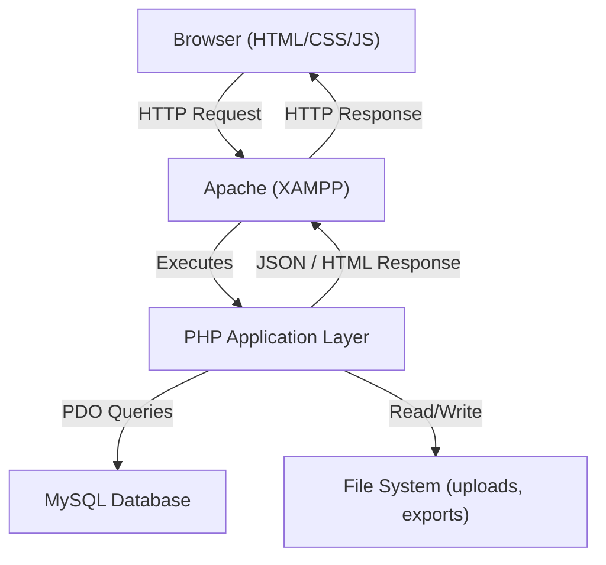
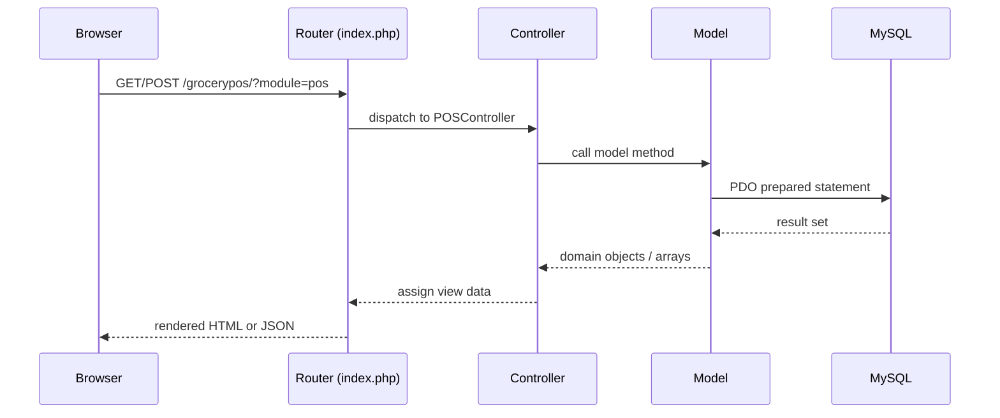
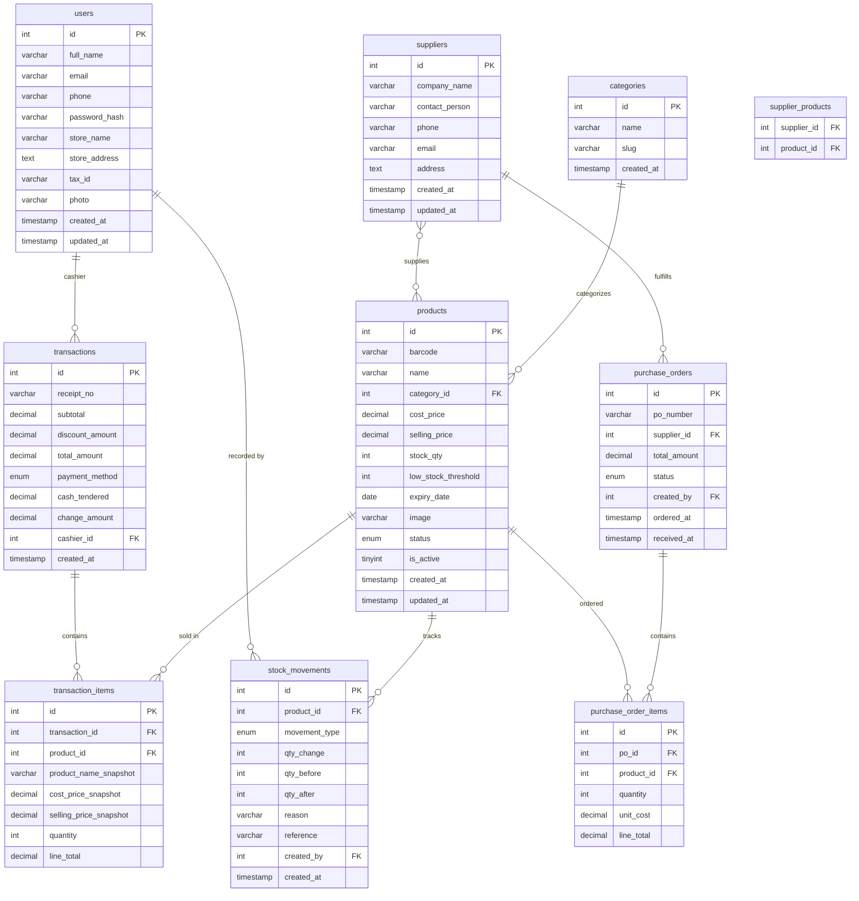
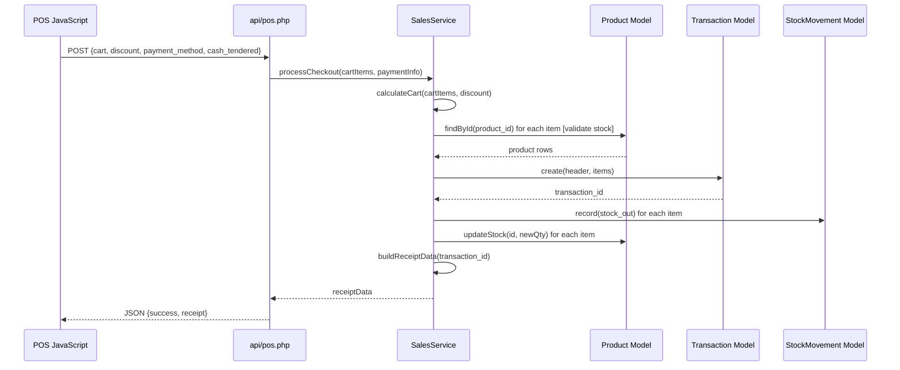

# Design Document: Grocery Store Point of Sale (POS) System

## Overview

GroceryPOS is a full-featured, browser-based Point of Sale system built for grocery stores running on XAMPP (localhost). It is implemented with PHP (backend), MySQL (database), and vanilla HTML/CSS/JavaScript (frontend), requiring no external frameworks beyond a CSS component library. The system handles sales transactions, inventory management, supplier tracking, analytics reporting, and administrative account settings — all denominated in Philippine Peso (₱).

The application follows a traditional server-side MVC pattern with a single-page feel achieved through JavaScript-driven tab/panel switching and AJAX calls for dynamic data. All pages are served from `c:\xampp\htdocs\grocerypos\` and communicate with MySQL via PHP PDO prepared statements.

The system is designed for a single-store, single-user (or small team) deployment on a local network. There is no cloud component; data backup is handled through manual database export tools built into the Account Settings module.

---

## Architecture

### High-Level System Architecture



### Request Flow



### Technology Stack

| Layer | Technology |
|---|---|
| Web Server | Apache 2.4 (XAMPP) |
| Backend | PHP 8.x |
| Database | MySQL 8.x (via phpMyAdmin) |
| Frontend | HTML5, CSS3, Vanilla JavaScript (ES6+) |
| CSS Framework | Bootstrap 5 (CDN) |
| Charts | Chart.js (CDN) |
| PDF Export | TCPDF or mPDF (Composer) |
| Excel Export | PhpSpreadsheet (Composer) |
| Icons | Bootstrap Icons (CDN) |

---

## File / Folder Structure

```
c:\xampp\htdocs\grocerypos\
│
├── index.php                  ← Front controller / router
├── config.php                 ← DB credentials, app constants
├── .htaccess                  ← Rewrite rules (optional)
│
├── app/
│   ├── controllers/
│   │   ├── DashboardController.php
│   │   ├── POSController.php
│   │   ├── ProductController.php
│   │   ├── InventoryController.php
│   │   ├── SalesController.php
│   │   ├── SupplierController.php
│   │   ├── TransactionController.php
│   │   └── AccountController.php
│   │
│   ├── models/
│   │   ├── Database.php           ← PDO singleton
│   │   ├── Product.php
│   │   ├── Category.php
│   │   ├── Transaction.php
│   │   ├── TransactionItem.php
│   │   ├── StockMovement.php
│   │   ├── Supplier.php
│   │   ├── PurchaseOrder.php
│   │   ├── PurchaseOrderItem.php
│   │   └── User.php
│   │
│   └── views/
│       ├── layout/
│       │   ├── header.php
│       │   ├── sidebar.php
│       │   └── footer.php
│       ├── dashboard/
│       │   └── index.php
│       ├── pos/
│       │   └── index.php
│       ├── products/
│       │   ├── index.php
│       │   ├── add.php
│       │   └── edit.php
│       ├── inventory/
│       │   └── index.php
│       ├── sales/
│       │   └── index.php
│       ├── suppliers/
│       │   ├── index.php
│       │   └── profile.php
│       ├── transactions/
│       │   └── index.php
│       └── account/
│           └── index.php
│
├── api/
│   ├── products.php           ← AJAX: product search, list
│   ├── pos.php                ← AJAX: checkout, cart ops
│   ├── inventory.php          ← AJAX: stock in/out
│   ├── sales.php              ← AJAX: analytics data
│   ├── transactions.php       ← AJAX: history, receipt
│   ├── suppliers.php          ← AJAX: supplier CRUD
│   └── dashboard.php          ← AJAX: dashboard metrics
│
├── assets/
│   ├── css/
│   │   └── app.css
│   ├── js/
│   │   ├── pos.js             ← Cart logic, checkout flow
│   │   ├── products.js        ← Product CRUD, import
│   │   ├── inventory.js       ← Stock movement UI
│   │   ├── sales.js           ← Chart rendering
│   │   ├── suppliers.js
│   │   ├── transactions.js
│   │   └── dashboard.js
│   └── img/
│       └── placeholder.png
│
├── uploads/
│   └── products/              ← Product images
│
└── exports/
    ├── pdf/                   ← Generated PDF reports
    └── excel/                 ← Generated Excel reports
```

---

## Database Schema

### Entity-Relationship Overview



### SQL Table Definitions

```sql
-- Users / Account
CREATE TABLE users (
    id              INT AUTO_INCREMENT PRIMARY KEY,
    full_name       VARCHAR(150) NOT NULL,
    email           VARCHAR(150) NOT NULL UNIQUE,
    phone           VARCHAR(30),
    password_hash   VARCHAR(255) NOT NULL,
    store_name      VARCHAR(150),
    store_address   TEXT,
    tax_id          VARCHAR(50),
    photo           VARCHAR(255),
    created_at      TIMESTAMP DEFAULT CURRENT_TIMESTAMP,
    updated_at      TIMESTAMP DEFAULT CURRENT_TIMESTAMP ON UPDATE CURRENT_TIMESTAMP
);

-- Product Categories
CREATE TABLE categories (
    id          INT AUTO_INCREMENT PRIMARY KEY,
    name        VARCHAR(100) NOT NULL,
    slug        VARCHAR(100) NOT NULL UNIQUE,
    created_at  TIMESTAMP DEFAULT CURRENT_TIMESTAMP
);

-- Products
CREATE TABLE products (
    id                  INT AUTO_INCREMENT PRIMARY KEY,
    barcode             VARCHAR(50) UNIQUE,
    name                VARCHAR(200) NOT NULL,
    category_id         INT NOT NULL,
    cost_price          DECIMAL(10,2) NOT NULL DEFAULT 0.00,
    selling_price       DECIMAL(10,2) NOT NULL DEFAULT 0.00,
    stock_qty           INT NOT NULL DEFAULT 0,
    low_stock_threshold INT NOT NULL DEFAULT 10,
    expiry_date         DATE,
    image               VARCHAR(255),
    status              ENUM('active','low_stock','out_of_stock','expiring_soon') DEFAULT 'active',
    is_active           TINYINT(1) DEFAULT 1,
    created_at          TIMESTAMP DEFAULT CURRENT_TIMESTAMP,
    updated_at          TIMESTAMP DEFAULT CURRENT_TIMESTAMP ON UPDATE CURRENT_TIMESTAMP,
    FOREIGN KEY (category_id) REFERENCES categories(id)
);

-- Sales Transactions
CREATE TABLE transactions (
    id              INT AUTO_INCREMENT PRIMARY KEY,
    receipt_no      VARCHAR(30) NOT NULL UNIQUE,
    subtotal        DECIMAL(10,2) NOT NULL,
    discount_amount DECIMAL(10,2) NOT NULL DEFAULT 0.00,
    total_amount    DECIMAL(10,2) NOT NULL,
    payment_method  ENUM('cash','digital') NOT NULL DEFAULT 'cash',
    cash_tendered   DECIMAL(10,2),
    change_amount   DECIMAL(10,2),
    cashier_id      INT,
    created_at      TIMESTAMP DEFAULT CURRENT_TIMESTAMP,
    FOREIGN KEY (cashier_id) REFERENCES users(id)
);

-- Transaction Line Items (price snapshot to protect historical accuracy)
CREATE TABLE transaction_items (
    id                      INT AUTO_INCREMENT PRIMARY KEY,
    transaction_id          INT NOT NULL,
    product_id              INT NOT NULL,
    product_name_snapshot   VARCHAR(200) NOT NULL,
    cost_price_snapshot     DECIMAL(10,2) NOT NULL,
    selling_price_snapshot  DECIMAL(10,2) NOT NULL,
    quantity                INT NOT NULL,
    line_total              DECIMAL(10,2) NOT NULL,
    FOREIGN KEY (transaction_id) REFERENCES transactions(id) ON DELETE CASCADE,
    FOREIGN KEY (product_id)     REFERENCES products(id)
);

-- Inventory Stock Movements (audit trail)
CREATE TABLE stock_movements (
    id              INT AUTO_INCREMENT PRIMARY KEY,
    product_id      INT NOT NULL,
    movement_type   ENUM('stock_in','stock_out','adjustment','sale') NOT NULL,
    qty_change      INT NOT NULL,
    qty_before      INT NOT NULL,
    qty_after       INT NOT NULL,
    reason          VARCHAR(255),
    reference       VARCHAR(100),
    created_by      INT,
    created_at      TIMESTAMP DEFAULT CURRENT_TIMESTAMP,
    FOREIGN KEY (product_id)  REFERENCES products(id),
    FOREIGN KEY (created_by)  REFERENCES users(id)
);

-- Suppliers
CREATE TABLE suppliers (
    id              INT AUTO_INCREMENT PRIMARY KEY,
    company_name    VARCHAR(200) NOT NULL,
    contact_person  VARCHAR(150),
    phone           VARCHAR(30),
    email           VARCHAR(150),
    address         TEXT,
    created_at      TIMESTAMP DEFAULT CURRENT_TIMESTAMP,
    updated_at      TIMESTAMP DEFAULT CURRENT_TIMESTAMP ON UPDATE CURRENT_TIMESTAMP
);

-- Supplier ↔ Product mapping
CREATE TABLE supplier_products (
    supplier_id INT NOT NULL,
    product_id  INT NOT NULL,
    PRIMARY KEY (supplier_id, product_id),
    FOREIGN KEY (supplier_id) REFERENCES suppliers(id),
    FOREIGN KEY (product_id)  REFERENCES products(id)
);

-- Purchase Orders
CREATE TABLE purchase_orders (
    id              INT AUTO_INCREMENT PRIMARY KEY,
    po_number       VARCHAR(30) NOT NULL UNIQUE,
    supplier_id     INT NOT NULL,
    total_amount    DECIMAL(10,2) NOT NULL DEFAULT 0.00,
    status          ENUM('pending','received','cancelled') NOT NULL DEFAULT 'pending',
    created_by      INT,
    ordered_at      TIMESTAMP DEFAULT CURRENT_TIMESTAMP,
    received_at     TIMESTAMP NULL,
    FOREIGN KEY (supplier_id) REFERENCES suppliers(id),
    FOREIGN KEY (created_by)  REFERENCES users(id)
);

-- Purchase Order Line Items
CREATE TABLE purchase_order_items (
    id          INT AUTO_INCREMENT PRIMARY KEY,
    po_id       INT NOT NULL,
    product_id  INT NOT NULL,
    quantity    INT NOT NULL,
    unit_cost   DECIMAL(10,2) NOT NULL,
    line_total  DECIMAL(10,2) NOT NULL,
    FOREIGN KEY (po_id)       REFERENCES purchase_orders(id) ON DELETE CASCADE,
    FOREIGN KEY (product_id)  REFERENCES products(id)
);
```

---

## Components and Interfaces

### Component 1: Database (PDO Singleton)

**Purpose**: Provides a single shared PDO connection used by all models.

```php
class Database {
    private static ?PDO $instance = null;

    public static function getInstance(): PDO;
    private static function connect(): PDO;
}
```

**Responsibilities**:
- Open one PDO connection per request with `PDO::ATTR_ERRMODE = EXCEPTION`
- Use prepared statements exclusively — no raw string interpolation in queries
- UTF-8 charset with `SET NAMES utf8mb4`

---

### Component 2: Product Model

**Purpose**: All CRUD and status computation for the products catalogue.

```php
class Product {
    public static function findAll(array $filters = []): array;
    public static function findById(int $id): ?array;
    public static function findByBarcode(string $barcode): ?array;
    public static function search(string $keyword, ?int $categoryId): array;
    public static function create(array $data): int;          // returns new ID
    public static function update(int $id, array $data): bool;
    public static function delete(int $id): bool;
    public static function updateStock(int $id, int $newQty): bool;
    public static function getLowStock(): array;
    public static function getExpiringSoon(int $daysAhead = 30): array;
    public static function computeStatus(array $product): string;
    public static function importFromCSV(string $filePath): array; // returns [success, errors]
}
```

**Status Computation Rules**:
- `out_of_stock` → `stock_qty === 0`
- `low_stock` → `stock_qty > 0 && stock_qty <= low_stock_threshold`
- `expiring_soon` → `expiry_date` within 30 days from today AND `stock_qty > 0`
- `active` → all other cases

---

### Component 3: Transaction Model

**Purpose**: Create and retrieve sales transactions with their line items.

```php
class Transaction {
    public static function create(array $header, array $items): int; // returns transaction ID
    public static function findById(int $id): ?array;
    public static function findByReceiptNo(string $receiptNo): ?array;
    public static function findAll(array $filters = []): array;
    public static function getSummary(string $dateFrom, string $dateTo): array;
    public static function generateReceiptNo(): string;
    public static function getPaymentSplit(string $dateFrom, string $dateTo): array;
}

class TransactionItem {
    public static function findByTransaction(int $transactionId): array;
    public static function bulkInsert(int $transactionId, array $items): void;
}
```

---

### Component 4: StockMovement Model

**Purpose**: Immutable audit log of every stock change.

```php
class StockMovement {
    public static function record(array $data): int;
    public static function findByProduct(int $productId): array;
    public static function findAll(array $filters = []): array;
    public static function getAuditLogs(array $filters = []): array;
}
```

---

### Component 5: Supplier & PurchaseOrder Models

```php
class Supplier {
    public static function findAll(): array;
    public static function findById(int $id): ?array;
    public static function create(array $data): int;
    public static function update(int $id, array $data): bool;
    public static function delete(int $id): bool;
    public static function getProductCount(int $supplierId): int;
    public static function getLastOrderDate(int $supplierId): ?string;
}

class PurchaseOrder {
    public static function create(array $header, array $items): int;
    public static function findAll(array $filters = []): array;
    public static function findById(int $id): ?array;
    public static function markReceived(int $id): bool;
    public static function generatePONumber(): string;
    public static function cancel(int $id): bool;
}
```

---

### Component 6: POS Controller

**Purpose**: Handles the checkout transaction lifecycle.

```php
class POSController {
    public function index(): void;       // render POS page
    public function checkout(): void;    // POST handler → calls SalesService::processCheckout()
    public function searchProducts(): void; // AJAX GET → returns JSON product list
}
```

---

### Component 7: SalesService (Core Business Logic)

**Purpose**: Encapsulates checkout calculation and stock deduction, keeping controllers thin.

```php
class SalesService {
    public static function processCheckout(array $cartItems, array $paymentInfo): array;
    public static function calculateCart(array $cartItems, float $discountValue, string $discountType): array;
    public static function deductStock(array $cartItems, int $transactionId): void;
    public static function buildReceiptData(int $transactionId): array;
}
```

---

### Component 8: AnalyticsService

**Purpose**: Aggregates sales data for the Sales & Analytics module.

```php
class AnalyticsService {
    public static function getDailySummary(string $date): array;
    public static function getWeeklySummary(string $weekStart): array;
    public static function getMonthlySummary(int $year, int $month): array;
    public static function getYearlySummary(int $year): array;
    public static function getProductPerformance(string $dateFrom, string $dateTo, ?int $categoryId): array;
    public static function getMonthComparison(int $year, int $month): array;
    public static function getRevenueTrend(int $year): array;
}
```

---

## Key Algorithms

### Algorithm 1: Checkout Calculation



```pascal
ALGORITHM calculateCart(cartItems, discountValue, discountType)
INPUT:
  cartItems      — array of {product_id, quantity, selling_price}
  discountValue  — numeric discount amount
  discountType   — "percent" | "fixed"
OUTPUT:
  result — {subtotal, discount_amount, total_amount}

BEGIN
  subtotal ← 0.00

  FOR each item IN cartItems DO
    ASSERT item.quantity > 0
    ASSERT item.selling_price >= 0
    line_total ← item.selling_price * item.quantity
    subtotal   ← subtotal + line_total
  END FOR

  IF discountType = "percent" THEN
    ASSERT 0 <= discountValue <= 100
    discount_amount ← ROUND(subtotal * (discountValue / 100), 2)
  ELSE  -- fixed peso amount
    ASSERT discountValue >= 0
    discount_amount ← MIN(discountValue, subtotal)
  END IF

  total_amount ← subtotal - discount_amount

  ASSERT total_amount >= 0.00
  ASSERT total_amount <= subtotal

  RETURN {subtotal, discount_amount, total_amount}
END
```

**Preconditions**:
- `cartItems` is non-empty
- Each item has `quantity > 0` and `selling_price >= 0`
- `discountValue >= 0`
- Percent discount is in range `[0, 100]`

**Postconditions**:
- `discount_amount >= 0`
- `total_amount = subtotal − discount_amount`
- `total_amount >= 0`

---

```pascal
ALGORITHM processCheckout(cartItems, paymentInfo)
INPUT:
  cartItems    — validated cart (product_id, qty, prices)
  paymentInfo  — {payment_method, cash_tendered, discount_value, discount_type}
OUTPUT:
  result — {success: bool, transaction_id, receipt_no, change_amount} | {success: false, error}

BEGIN
  -- Step 1: Validate stock availability
  FOR each item IN cartItems DO
    product ← Product.findById(item.product_id)
    IF product IS NULL OR product.is_active = 0 THEN
      RETURN {success: false, error: "Product not found: " + item.product_id}
    END IF
    IF product.stock_qty < item.quantity THEN
      RETURN {success: false, error: "Insufficient stock for: " + product.name}
    END IF
  END FOR

  -- Step 2: Calculate totals
  cartResult ← calculateCart(cartItems, paymentInfo.discount_value, paymentInfo.discount_type)

  -- Step 3: Validate payment
  IF paymentInfo.payment_method = "cash" THEN
    IF paymentInfo.cash_tendered < cartResult.total_amount THEN
      RETURN {success: false, error: "Insufficient cash tendered"}
    END IF
    change_amount ← ROUND(paymentInfo.cash_tendered - cartResult.total_amount, 2)
  ELSE
    change_amount ← 0.00
  END IF

  -- Step 4: Persist transaction (inside DB transaction)
  BEGIN DATABASE TRANSACTION
    receipt_no     ← Transaction.generateReceiptNo()
    transaction_id ← Transaction.create({
      receipt_no, subtotal, discount_amount, total_amount,
      payment_method, cash_tendered, change_amount, cashier_id
    }, cartItems)

    -- Step 5: Deduct stock and record movements
    FOR each item IN cartItems DO
      product    ← Product.findById(item.product_id)
      qty_before ← product.stock_qty
      qty_after  ← qty_before - item.quantity

      Product.updateStock(item.product_id, qty_after)
      StockMovement.record({
        product_id, movement_type: "sale",
        qty_change: -item.quantity, qty_before, qty_after,
        reference: receipt_no
      })
    END FOR
  COMMIT DATABASE TRANSACTION

  RETURN {success: true, transaction_id, receipt_no, change_amount}

  ON ERROR:
    ROLLBACK DATABASE TRANSACTION
    RETURN {success: false, error: "Checkout failed. Please retry."}
END
```

**Loop Invariant**: After processing `k` items, all previously deducted stock values are consistent with their movement records, and the running total of deducted quantities equals the sum of quantities for items 1..k.

---

### Algorithm 2: Product Status Computation

```pascal
ALGORITHM computeProductStatus(product)
INPUT:  product — {stock_qty, low_stock_threshold, expiry_date}
OUTPUT: status  — "out_of_stock" | "low_stock" | "expiring_soon" | "active"

BEGIN
  IF product.stock_qty = 0 THEN
    RETURN "out_of_stock"
  END IF

  days_to_expiry ← DATEDIFF(product.expiry_date, TODAY())

  IF product.expiry_date IS NOT NULL AND days_to_expiry <= 30 AND days_to_expiry >= 0 THEN
    RETURN "expiring_soon"
  END IF

  IF product.stock_qty <= product.low_stock_threshold THEN
    RETURN "low_stock"
  END IF

  RETURN "active"
END
```

**Note**: Status is recomputed on every product save (INSERT/UPDATE) and stored in the `status` column for fast dashboard queries. A nightly MySQL EVENT can also recompute statuses for expiry drift.

---

### Algorithm 3: Sales Analytics Aggregation

```pascal
ALGORITHM getMonthlySummary(year, month)
INPUT:  year, month — integers
OUTPUT: summary — {total_revenue, total_profit, transaction_count, items_sold}

BEGIN
  date_from ← FIRST DAY of (year, month)
  date_to   ← LAST DAY of (year, month)

  -- Aggregate from transaction_items joined to transactions
  -- Profit = (selling_price_snapshot - cost_price_snapshot) * quantity  per item
  QUERY:
    SELECT
      SUM(t.total_amount)                                             AS total_revenue,
      SUM((ti.selling_price_snapshot - ti.cost_price_snapshot)
           * ti.quantity)                                             AS total_profit,
      COUNT(DISTINCT t.id)                                            AS transaction_count,
      SUM(ti.quantity)                                                AS items_sold
    FROM transactions t
    JOIN transaction_items ti ON ti.transaction_id = t.id
    WHERE t.created_at BETWEEN date_from AND date_to

  RETURN summary
END
```

```pascal
ALGORITHM getRevenueTrend(year)
INPUT:  year — integer
OUTPUT: trend — array[12] of {month, revenue, profit, transactions}

BEGIN
  trend ← empty array

  FOR month ← 1 TO 12 DO
    summary    ← getMonthlySummary(year, month)
    trend[month] ← {month, summary.total_revenue, summary.total_profit,
                    summary.transaction_count}
  END FOR

  RETURN trend
END
```

---

### Algorithm 4: Inventory Stock In / Stock Out

```pascal
ALGORITHM processStockMovement(productId, movementType, qtyChange, reason, reference, userId)
INPUT:
  productId    — int
  movementType — "stock_in" | "stock_out" | "adjustment"
  qtyChange    — positive integer (direction encoded by movementType)
  reason, reference, userId

OUTPUT: {success: bool, new_qty}

BEGIN
  product ← Product.findById(productId)
  IF product IS NULL THEN
    RETURN {success: false, error: "Product not found"}
  END IF

  qty_before ← product.stock_qty

  IF movementType = "stock_in" THEN
    qty_after ← qty_before + qtyChange
  ELSE IF movementType = "stock_out" THEN
    IF qty_before < qtyChange THEN
      RETURN {success: false, error: "Cannot go below zero stock"}
    END IF
    qty_after ← qty_before - qtyChange
  ELSE  -- adjustment (can be negative delta, passed in qtyChange)
    qty_after ← qty_before + qtyChange
    IF qty_after < 0 THEN
      RETURN {success: false, error: "Adjustment would result in negative stock"}
    END IF
  END IF

  BEGIN DATABASE TRANSACTION
    Product.updateStock(productId, qty_after)
    StockMovement.record({
      productId, movementType,
      qty_change: qtyChange, qty_before, qty_after,
      reason, reference, created_by: userId
    })
    -- Recompute and persist status
    newStatus ← computeProductStatus({stock_qty: qty_after, ...product})
    Product.update(productId, {status: newStatus})
  COMMIT

  RETURN {success: true, new_qty: qty_after}
END
```

---

## API / Route Structure

All requests pass through `index.php?module=X&action=Y` for page views, and direct PHP files under `api/` for AJAX JSON endpoints.

### Page Routes (index.php dispatcher)

| URL | Module | Action | Controller |
|---|---|---|---|
| `?module=dashboard` | Dashboard | index | DashboardController |
| `?module=pos` | POS | index | POSController |
| `?module=products` | Products | index/add/edit/delete | ProductController |
| `?module=inventory` | Inventory | index | InventoryController |
| `?module=sales` | Sales & Analytics | index | SalesController |
| `?module=suppliers` | Suppliers | index/profile | SupplierController |
| `?module=transactions` | Transaction History | index | TransactionController |
| `?module=account` | Account Settings | index | AccountController |

### AJAX API Endpoints

#### `api/products.php`

| Method | Action param | Description | Returns |
|---|---|---|---|
| GET | `list` | All products (with filters: category, status, search) | JSON array |
| GET | `search` | Keyword + optional category search for POS grid | JSON array |
| GET | `get` | Single product by `id` or `barcode` | JSON object |
| POST | `create` | Create new product (multipart with image) | JSON {success, id} |
| POST | `update` | Update product | JSON {success} |
| POST | `delete` | Soft-delete product | JSON {success} |
| POST | `import` | CSV import | JSON {success, count, errors} |

#### `api/pos.php`

| Method | Action | Description | Returns |
|---|---|---|---|
| POST | `checkout` | Process cart, deduct stock, save transaction | JSON {success, receipt} |
| POST | `void` | Void a transaction (admin) | JSON {success} |

#### `api/inventory.php`

| Method | Action | Description | Returns |
|---|---|---|---|
| GET | `movements` | Stock movement log (filters: product, type, date) | JSON array |
| GET | `low_stock` | Products below threshold | JSON array |
| GET | `expiring` | Products expiring within N days | JSON array |
| GET | `valuation` | Total inventory value (cost & selling) | JSON object |
| POST | `stock_in` | Add stock, record movement | JSON {success, new_qty} |
| POST | `stock_out` | Remove stock, record movement | JSON {success, new_qty} |
| POST | `adjustment` | Adjust to exact qty | JSON {success, new_qty} |

#### `api/sales.php`

| Method | Action | Description | Returns |
|---|---|---|---|
| GET | `daily` | Daily summary for a date | JSON object |
| GET | `weekly` | Weekly summary | JSON object |
| GET | `monthly` | Monthly summary | JSON object |
| GET | `yearly` | Yearly summary | JSON object |
| GET | `trend` | 12-month revenue trend array | JSON array[12] |
| GET | `product_performance` | Per-product stats for date range | JSON array |
| GET | `month_comparison` | Current vs previous month | JSON object |
| GET | `export_pdf` | Stream PDF report | PDF file |
| GET | `export_excel` | Stream Excel report | XLSX file |

#### `api/transactions.php`

| Method | Action | Description | Returns |
|---|---|---|---|
| GET | `list` | All transactions (filters: receipt#, date range) | JSON array |
| GET | `get` | Single transaction with items | JSON object |
| GET | `receipt` | HTML/PDF receipt for printing | HTML or PDF |
| GET | `summary` | Totals for a date range | JSON object |
| GET | `export_pdf` | Export transaction list PDF | PDF file |
| GET | `export_excel` | Export transaction list Excel | XLSX file |

#### `api/suppliers.php`

| Method | Action | Description | Returns |
|---|---|---|---|
| GET | `list` | All suppliers | JSON array |
| GET | `get` | Single supplier with linked products | JSON object |
| POST | `create` | Add supplier | JSON {success, id} |
| POST | `update` | Update supplier | JSON {success} |
| POST | `delete` | Delete supplier | JSON {success} |
| POST | `po_create` | Create purchase order | JSON {success, po_id} |
| POST | `po_receive` | Mark PO as received (triggers stock_in) | JSON {success} |
| GET | `po_list` | All POs (filter by supplier/status) | JSON array |

#### `api/dashboard.php`

| Method | Action | Description | Returns |
|---|---|---|---|
| GET | `metrics` | Today's sales, transactions, revenue, profit | JSON object |
| GET | `alerts` | Low stock + expiring products counts | JSON object |
| GET | `best_sellers` | Top N products by units sold today | JSON array |
| GET | `recent_transactions` | Last 10 transactions | JSON array |
| GET | `monthly_chart` | 12-month bar chart data | JSON array |
| GET | `inventory_status` | % breakdown by status | JSON object |

---

## Frontend Component Design (JavaScript)

### POS Cart State (pos.js)

```javascript
// Cart state object — lives in memory during a POS session
const cartState = {
    items: [],          // [{product_id, name, price, quantity, subtotal}]
    discountType: 'percent',  // 'percent' | 'fixed'
    discountValue: 0,
    subtotal: 0,
    discountAmount: 0,
    total: 0,
    paymentMethod: 'cash',
    cashTendered: 0,
    change: 0
};

function addToCart(product)         // add item or increment qty
function removeFromCart(productId)  // remove line
function updateQty(productId, qty)  // set specific qty, remove if 0
function applyDiscount(value, type) // recalculate totals
function recalculateTotals()        // pure calculation, updates cartState
function renderCart()               // reflect cartState → DOM
function checkout()                 // POST to api/pos.php?action=checkout
function clearCart()                // reset cartState, re-render
function printReceipt(receiptData)  // open print dialog with receipt HTML
```

### Chart Initialization (sales.js)

```javascript
function initRevenueChart(labels, revenueData, profitData) // Chart.js bar
function initTrendChart(labels, trendData)                  // Chart.js line
function loadAnalytics(tab, filters)                        // AJAX fetch + chart update
```

---

## Data Models

### Product

```php
[
    'id'                  => int,
    'barcode'             => string,          // e.g. "8850999352059"
    'name'                => string,
    'category_id'         => int,
    'category_name'       => string,          // joined from categories
    'cost_price'          => float,           // ₱ acquisition cost
    'selling_price'       => float,           // ₱ price charged to customer
    'stock_qty'           => int,
    'low_stock_threshold' => int,             // default 10
    'expiry_date'         => string|null,     // "YYYY-MM-DD"
    'image'               => string|null,     // relative path in uploads/products/
    'status'              => string,          // "active"|"low_stock"|"out_of_stock"|"expiring_soon"
    'is_active'           => bool,
    'created_at'          => string,
    'updated_at'          => string,
]
```

**Validation Rules**:
- `name` — required, max 200 chars
- `selling_price` — required, ≥ 0
- `cost_price` — required, ≥ 0
- `stock_qty` — required, integer ≥ 0
- `barcode` — optional, unique when provided
- `expiry_date` — optional, must be a valid future or present date

---

### Transaction

```php
[
    'id'              => int,
    'receipt_no'      => string,     // e.g. "RCP-20240615-0001"
    'subtotal'        => float,      // sum of all line_totals before discount
    'discount_amount' => float,      // computed discount in ₱
    'total_amount'    => float,      // subtotal - discount_amount
    'payment_method'  => string,     // "cash" | "digital"
    'cash_tendered'   => float|null, // only for cash payments
    'change_amount'   => float|null, // cash_tendered - total_amount, cash only
    'cashier_id'      => int|null,
    'created_at'      => string,
    'items'           => TransactionItem[],  // populated on findById()
]
```

---

### TransactionItem

```php
[
    'id'                     => int,
    'transaction_id'         => int,
    'product_id'             => int,
    'product_name_snapshot'  => string,  // name at time of sale (immutable)
    'cost_price_snapshot'    => float,   // cost at time of sale (immutable)
    'selling_price_snapshot' => float,   // price at time of sale (immutable)
    'quantity'               => int,
    'line_total'             => float,   // selling_price_snapshot * quantity
]
```

**Validation Rules**:
- `quantity` — integer ≥ 1
- `line_total` must equal `selling_price_snapshot * quantity`
- Price snapshots are copied from product at checkout time and never updated

---

### StockMovement

```php
[
    'id'            => int,
    'product_id'    => int,
    'product_name'  => string,   // joined
    'movement_type' => string,   // "stock_in"|"stock_out"|"adjustment"|"sale"
    'qty_change'    => int,      // positive for in, negative for out/sale
    'qty_before'    => int,
    'qty_after'     => int,
    'reason'        => string|null,
    'reference'     => string|null,  // receipt_no or PO number
    'created_by'    => int|null,
    'created_at'    => string,
]
```

**Validation Rules**:
- `qty_after = qty_before + qty_change` must always hold
- `qty_after >= 0` — never negative stock
- `movement_type` is one of the four enum values

---

### Supplier

```php
[
    'id'             => int,
    'company_name'   => string,
    'contact_person' => string|null,
    'phone'          => string|null,
    'email'          => string|null,
    'address'        => string|null,
    'product_count'  => int,      // computed: count of linked products
    'last_order_date'=> string|null,  // computed: max ordered_at from POs
    'created_at'     => string,
    'updated_at'     => string,
]
```

---

### PurchaseOrder

```php
[
    'id'           => int,
    'po_number'    => string,     // e.g. "PO-20240615-0001"
    'supplier_id'  => int,
    'supplier_name'=> string,     // joined
    'total_amount' => float,
    'status'       => string,     // "pending"|"received"|"cancelled"
    'created_by'   => int|null,
    'ordered_at'   => string,
    'received_at'  => string|null,
    'items'        => PurchaseOrderItem[],
]
```

---

### CartItem (frontend / API request payload)

```php
[
    'product_id'    => int,
    'name'          => string,
    'cost_price'    => float,
    'selling_price' => float,
    'quantity'      => int,
    'subtotal'      => float,   // selling_price * quantity, computed client-side
]
```

---

### AnalyticsSummary

```php
[
    'total_revenue'     => float,
    'total_profit'      => float,
    'transaction_count' => int,
    'items_sold'        => int,
]
```

---

### DashboardMetrics

```php
[
    'sales_today'          => float,
    'transactions_today'   => int,
    'total_revenue_alltime'=> float,
    'total_profit_alltime' => float,
    'low_stock_count'      => int,
    'expiring_count'       => int,
    'total_products'       => int,
    'inventory_status'     => [
        'well_stocked'   => int,  // percentage
        'low_stock'      => int,
        'out_of_stock'   => int,
        'expiring_soon'  => int,
    ],
    'best_sellers'         => array,   // top 5 products by qty today
    'recent_transactions'  => array,   // last 10 transactions
    'monthly_chart'        => array,   // 12 months revenue data
]
```

---

## Correctness Properties

These invariants must hold at all times and are validated via unit and integration tests.

### Property 1: Cart Total Invariant

For any cart with items and any valid discount:
```
total_amount = subtotal - discount_amount
AND total_amount >= 0
AND discount_amount >= 0
AND discount_amount <= subtotal
```

### Property 2: Stock Conservation

After every checkout, for each sold item:
```
product.stock_qty_after = product.stock_qty_before - quantity_sold
AND stock_movement.qty_after = stock_movement.qty_before - quantity_sold
AND product.stock_qty >= 0  -- never negative
```

### Property 3: Transaction Item Accuracy

For every transaction item:
```
line_total = selling_price_snapshot * quantity
AND SUM(line_total for all items) = transaction.subtotal
```

### Property 4: Stock Movement Consistency

For every stock movement record:
```
qty_after = qty_before + qty_change
-- where qty_change is negative for sales/stock_out, positive for stock_in
```

### Property 5: Receipt Number Uniqueness

```
∀ t1, t2 ∈ transactions: t1.id ≠ t2.id → t1.receipt_no ≠ t2.receipt_no
```

### Property 6: Profit Calculation Correctness

For any period summary:
```
total_profit = SUM((selling_price_snapshot - cost_price_snapshot) * quantity)
             for all transaction_items in that period
```

### Property 7: Cash Change Invariant

For cash payment transactions:
```
change_amount = cash_tendered - total_amount
AND cash_tendered >= total_amount  -- ensured before checkout is allowed
AND change_amount >= 0
```

### Property 8: Discount Percent Boundary

For percent-type discounts:
```
0 <= discount_value <= 100
AND discount_amount = ROUND(subtotal * discount_value / 100, 2)
```

---

## Error Handling

### Checkout Errors

| Condition | Response | Recovery |
|---|---|---|
| Insufficient stock | `{success: false, error: "Insufficient stock for: [name]"}` | Cashier adjusts quantity in cart |
| Cash tendered < total | `{success: false, error: "Insufficient cash tendered"}` | Cashier corrects cash amount |
| DB transaction failure | `{success: false, error: "Checkout failed. Please retry."}` | Transaction rolled back; no stock deducted |
| Empty cart | Prevented client-side before POST | Checkout button disabled until cart has ≥1 item |

### Inventory Errors

| Condition | Response |
|---|---|
| Stock out below zero | HTTP 400 + error message |
| Product not found | HTTP 404 + error message |

### File Upload Errors (Product Image / CSV Import)

| Condition | Response |
|---|---|
| File too large (>2MB image) | Validation error before save |
| Invalid CSV format | Row-level error report returned |
| Unsupported file type | Rejected with allowed types message |

---

## Testing Strategy

### Unit Testing Approach

Test each model method and service function in isolation using PHPUnit. Key test cases:

- `calculateCart()` with percent/fixed discounts, zero discount, and edge cases (discount > subtotal)
- `computeProductStatus()` for all four status branches
- `generateReceiptNo()` uniqueness under concurrent calls
- `processStockMovement()` — stock_in, stock_out, adjustment, negative guard

### Property-Based Testing Approach

**Library**: PHPUnit with custom data providers (or `eris/eris` for PHP property-based testing)

Key properties to verify:
- `total_amount = subtotal − discount_amount` for any valid cart
- `discount_amount ≥ 0` for any non-negative discount input
- `total_amount ≥ 0` regardless of discount magnitude
- `qty_after = qty_before + qty_change` for every stock movement record
- Receipt numbers are unique across any sequence of checkouts

### Integration Testing Approach

- Full checkout flow: POST cart → verify `transactions`, `transaction_items`, `stock_movements`, and updated `products.stock_qty`
- Stock in receiving: PO marked received → stock movement recorded → product qty updated
- Analytics aggregation: insert known transactions → assert summary matches expected totals

---

## Security Considerations

- All database access uses **PDO prepared statements** — no string interpolation in SQL
- **Session-based authentication**: pages redirect to login if session is absent
- **File upload validation**: MIME type check + extension allowlist (jpg, png, webp for images; csv for import)
- **CSRF protection**: form tokens on all state-modifying POST requests
- **Input sanitization**: `htmlspecialchars()` on all output to prevent XSS
- **Password hashing**: `password_hash()` / `password_verify()` (bcrypt) for user credentials
- **Directory protection**: `uploads/` and `exports/` served only through PHP, not directly browseable (`.htaccess` deny)

---

## Performance Considerations

- Dashboard metrics queries use indexed columns (`created_at`, `product_id`, `transaction_id`)
- `products.status` is a stored column (not computed at query time) for fast filter queries
- Analytics aggregation uses date-range indexes; heavy reports are computed on demand and optionally cached in the `exports/` folder for re-download
- Product search in POS uses `LIKE %keyword%` on name + barcode — acceptable for a single-store catalogue of typical size (< 10,000 products); a `FULLTEXT` index can be added if needed
- Chart data is fetched via AJAX after page load to keep initial render fast

---

## Dependencies

| Dependency | Purpose | Installation |
|---|---|---|
| Bootstrap 5 | UI layout, components, responsive grid | CDN |
| Bootstrap Icons | Icon set | CDN |
| Chart.js | Sales & analytics charts | CDN |
| TCPDF or mPDF | PDF receipt and report generation | Composer |
| PhpSpreadsheet | Excel export (XLSX) | Composer |
| PHPUnit | Unit and integration testing | Composer (dev) |

**Composer packages** (`composer.json`):
```json
{
  "require": {
    "tecnickcom/tcpdf": "^6.6",
    "phpoffice/phpspreadsheet": "^2.1"
  },
  "require-dev": {
    "phpunit/phpunit": "^10.0"
  }
}
```
